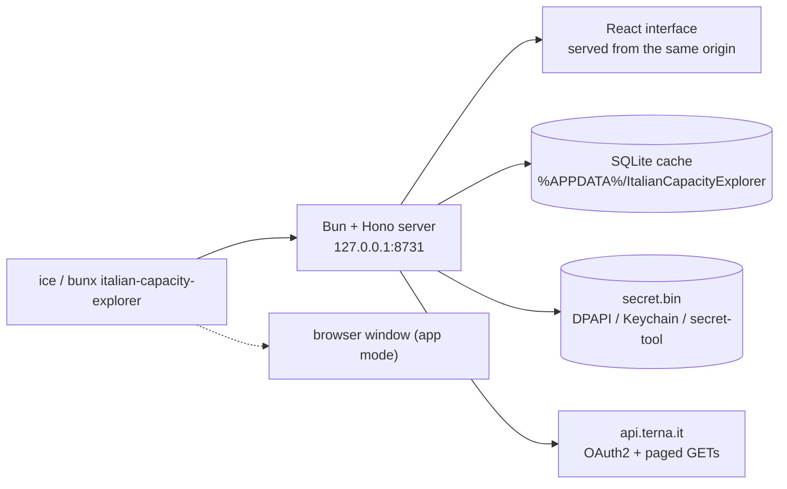

# Italian Capacity Explorer

A local-first application to explore **Italy's installed generation capacity**
published through the [Terna Developer API](https://developer.terna.it): a
dashboard with charts and exports, a local SQLite cache, and credentials that
never leave your machine.

It runs as a small local server (Bun + TypeScript) that serves the interface and
the data API from the same origin, and opens a browser window — or installs as a
PWA with its own window and Start-menu entry. No cloud, no account, no
compilation required to *use* it.

> **Disclaimer** — this is an independent, community project. It is **not**
> affiliated with, endorsed by or supported by Terna S.p.A. Data is © Terna S.p.A.
> and is retrieved with each user's own free Terna Developer credentials.

---

## Table of contents

- [Run it](#run-it)
- [Features](#features)
- [How it works](#how-it-works)
- [Repository layout](#repository-layout)
- [Development](#development)
- [Building a distributable](#building-a-distributable)
- [Configuration](#configuration)
- [Backend HTTP API](#backend-http-api)
- [Data model and analytics semantics](#data-model-and-analytics-semantics)
- [Testing](#testing)
- [Privacy and security](#privacy-and-security)
- [Code signing policy](#code-signing-policy)
- [Distribution](#distribution)
- [Troubleshooting](#troubleshooting)
- [Known limitations](#known-limitations)
- [Contributing](#contributing)
- [License](#license)

## Run it

**With Bun installed** (nothing to download, always the current release):

```bash
bunx italian-capacity-explorer
```

**Without any runtime**: download `ItalianCapacityExplorer_<version>_x64-portable.zip`
from the releases page, extract it and run `ice.exe`. The archive contains the
executable *and* the `static/` folder with the interface — keep them together.

Either way the app serves itself on `http://127.0.0.1:8731` and opens a browser
window. In Chromium-based browsers you can then install it as an app: its own
window without tabs, an icon in the taskbar and an entry in the Start menu.
Everything else — data, credentials, cache — stays on your machine.

### Screenshots

| Dashboard (dark) | Dashboard (light) | Data sync |
| --- | --- | --- |
|  |  |  |

## Features

- **Guided onboarding** for Terna Developer credentials (client id + secret).
- **One-click sync**: any year range, every dataset/source/capacity type.
  Rate-limit aware (1 request/second by default), resumable, per-step progress,
  and it never aborts the whole job because one step failed.
- **Dashboard**: KPI cards (latest-year stock, year-on-year additions, year
  range), five interactive charts, and a searchable, sortable, paginated records
  table with the unit of measure on every axis.
- **Exports**: any chart as PNG / SVG / CSV, the filtered table as CSV.
- **Offline after sync**: SQLite cache, self-hosted fonts, light & dark themes.
- **Installable**: runs in the browser or as an installed app (PWA), with a
  stable local origin so the installation keeps working across restarts.

## How it works



One process, one origin. Serving the interface from the same server that exposes
the API removes port discovery, CORS and CSP exceptions: the browser only ever
talks to `127.0.0.1`. Types in `shared/types.ts` are the contract for both sides.

The earlier versions used a Rust/Tauri shell with a Python/FastAPI sidecar; the
current runtime is TypeScript on Bun, which removed two toolchains, the 50 MB
sidecar and the installer pipeline. See `notes/proposta-architettura.md` for the
migration record.

## Repository layout

```
├── server/                Bun + Hono backend (data layer, sync, CLI)
│   ├── cli.ts             entry point: port, server, window, logs
│   ├── api.ts             the HTTP routes
│   ├── http.ts            SPA hosting, CSP, SPA fallback
│   ├── db.ts              SQLite cache: schema, upserts, analytics queries
│   ├── terna.ts           OAuth2 client with pacing and retries
│   ├── sync.ts            sync planner and job manager
│   ├── normalize.ts       payload → rows (numeric parsing included)
│   ├── secrets.ts         DPAPI / Keychain / secret-tool secret storage
│   └── settings.ts        app data folder and settings
├── shared/types.ts        data contract shared by server and interface
├── src/                   React interface (pages, components, hooks)
├── public/                manifest, service worker, icons, favicon
├── tests/                 bun test suites (39 tests)
├── scripts/               copy-static.ts, generate-brand-assets.py
├── assets/                icon sources for the compiled executable
└── docs/                  screenshots, code-signing guide, data validation
```

## Development

Requires [Bun](https://bun.sh) ≥ 1.2 (a single binary, no other toolchain).

```bash
bun install
bun run serve           # http://127.0.0.1:8731, opens a browser window
bun run dev             # Vite dev server on :1420 with hot reload, proxies the API
bun test                # 39 tests
bun run typecheck       # interface + server
```

In development the Vite server proxies `/health`, `/records`, `/analytics`,
`/metadata`, `/settings`, `/sync` and `/export` to the local server, so the
interface uses relative URLs in every mode and no environment variable is needed.

## Building a distributable

```bash
bun run compile
```

This builds the interface, copies it to `static/` and compiles a single-file
executable into `dist-exe/ice.exe` (~82 MB, Bun runtime included) with the icon
and version metadata embedded. Ship it together with `static/`:

```
ItalianCapacityExplorer_1.2.0_x64-portable.zip
├── ice.exe
└── static/…
```

`bun run compile` takes about 30 seconds, of which 1.7 s is the actual compile
(the earlier PyInstaller sidecar took over two minutes).

## Configuration

| Variable | Default | Purpose |
| --- | --- | --- |
| `ICE_PORT` | `8731` | stable port (the installed PWA's origin includes it) |
| `ICE_STATIC_DIR` | alongside the executable / `static/` | where the interface lives |
| `TERNA_MIN_REQUEST_INTERVAL` | `1.0` | minimum seconds between Terna API calls |
| `TERNA_APP_DATA_DIR` | `%APPDATA%\ItalianCapacityExplorer` | database, settings, log |
| `TERNA_CLIENT_ID` / `TERNA_CLIENT_SECRET` | – | credentials for headless runs |

CLI flags: `--browser` (system browser instead of the app window), `--no-window`
(server only), `--port N`, `--data-dir DIR`, `--help`.

Data written at runtime:

| Path | Content |
| --- | --- |
| `%APPDATA%\ItalianCapacityExplorer\terna_cache.sqlite` | local cache (delete it to force a full re-sync) |
| `%APPDATA%\ItalianCapacityExplorer\settings.json` | non-secret settings (client id, database path) |
| `%APPDATA%\ItalianCapacityExplorer\secret.bin` | client secret, encrypted with DPAPI |
| `%APPDATA%\ItalianCapacityExplorer\backend.log` | startup log |

## Backend HTTP API

The local server exposes a small JSON API on `127.0.0.1` (no authentication —
see [Privacy and security](#privacy-and-security)).

| Method & path | Purpose |
| --- | --- |
| `GET /health` | readiness probe |
| `GET /settings/credentials/status` | `{configured, client_id_suffix}` |
| `POST /settings/credentials` | store id + secret (secret → DPAPI file) |
| `DELETE /settings/credentials` | remove both |
| `POST /settings/credentials/test` | OAuth2 round-trip against Terna |
| `POST /sync/jobs` | start a sync job → `{job_id, status}` |
| `GET /sync/jobs/{id}` | `{status, total_steps, completed_steps, failed_steps, empty_steps, message, error}` |
| `GET /metadata/options` | canonical sources/types per dataset, stored options, year window |
| `GET /metadata/availability` | row counts per dataset/year actually cached |
| `GET /records` | paged rows (`limit` ≤ 100000, `offset`) |
| `GET /analytics/summary` | latest-year stock, previous year, YoY delta, row count |
| `GET /analytics/timeseries` | grouped sums, `group_by=year,source`, `latest_only=true` |
| `GET /export/csv` | every row matching the filters as CSV |

Filters accepted by `records`, `analytics/*` and `export/csv`: `dataset`,
`year_from`, `year_to`, `region`, `province`, `source`, `capacity_type`
(`Lorda`/`Netta`), `category`, `subcategory`, `type`.

## Data model and analytics semantics

One `capacity_records` row is a dataset × year × geography × source × capacity-type
combination:

| Column | Unit | Notes |
| --- | --- | --- |
| `dataset` | – | `renewable_source_capacity`, `generation_plants`, `installed_capacity`, `thermoelectric_capacity` |
| `year`, `region`, `province`, `source`, `category`, `subcategory`, `type`, `capacity_type` | – | dimension; `NULL` when the endpoint does not publish it |
| `efficient_power_mw` | MW | renewable, generation-plants and thermoelectric datasets |
| `installed_capacity_gw` | GW | national `installed_capacity` dataset only |
| `fetched_at` | ISO-8601 UTC | last successful fetch |

Analytics rules the interface relies on:

- **Stock, not sum.** Totals and `latest_only` aggregations refer to the latest
  year in the selection. Summing several years would count the same plant
  several times.
- **One capacity index at a time.** `Lorda` (gross) and `Netta` (net) are never
  added together; `summary` defaults to `Lorda` and reports
  `capacity_type_applied`.
- **Year-on-year additions** are the delta of that stock between the last two
  years in the selection — a proxy for new capacity, net of decommissioning.
- **Empty is not an error.** Terna answers unpublished years/values with an empty
  body, so the sync counts them as `empty_steps`.

Units caveat: the Terna `/installed-capacity` payload labels the field
`installed_capacity_GWh` but returns GW values (`"59.7902"` = 59.7902 GW); the
parser handles dot-decimal strings accordingly.

[`docs/data-validation.md`](docs/data-validation.md) documents the validation of
these numbers against the raw API and against Terna's official yearbook: wind,
geothermal and thermoelectric totals match to the decimal, while the API's hydro
and older photovoltaic series use a narrower perimeter than the published
statistics. Quote the yearbook (or GSE) for official national figures; use this
app for trends, regional breakdowns and exports.

## Testing

```bash
bun test          # 39 tests: parsing, storage, analytics, sync planning, client, API
bun run typecheck # strict TypeScript for interface and server
bun run build     # production interface bundle
```

The suite runs without credentials, without network access and in a few seconds:
the Terna client takes an injected `fetch`, so retry and rate-limit behaviour is
tested against a stub. CI additionally compiles the executable and smoke-tests it
(`/health` plus the interface) on Windows.

## Privacy and security

- Outbound traffic is limited to `api.terna.it` (OAuth2 token + data endpoints).
  No analytics, telemetry, update checks or third-party CDNs.
- The server binds `127.0.0.1` and serves both the API and the interface from the
  same origin; a strict `Content-Security-Policy` is sent on every response. No
  CORS headers are emitted, so a hostile page cannot read local responses.
- The client **secret** is encrypted with **Windows DPAPI** (user scope) into
  `secret.bin` inside the app data folder; on macOS it goes to the Keychain, on
  Linux to the `secret-tool` store. The client id stays in `settings.json`
  because it is not a secret.
- **The app never reads credentials belonging to other applications.** No
  script interpreter is spawned, no OS credential vault is queried, nothing is
  written outside the app data folder and the log file. Automated scanners flag
  such patterns — correctly — as infostealer behaviour, so the code avoids them
  by design.
- The API has **no authentication**: any local process can read the cache and
  overwrite the stored credentials (it can never read the secret back — the API
  only ever returns `configured` plus a masked id). Treat the machine's other
  users/processes as trusted.
- The single-file executable produced by `bun build --compile` is unsigned, so
  antivirus heuristics and SmartScreen will scrutinise it; signing is the fix
  (see below). The npm channel never builds or ships a binary.

## Code signing policy

Free code signing provided by [SignPath.io](https://about.signpath.io),
certificate by [SignPath Foundation](https://signpath.org).

- **Committers and reviewers**: the repository owner (single-maintainer project).
- **Approvers**: the repository owner — every release is approved manually before
  it is signed.

This program will not transfer any information to other networked systems unless
specifically requested by the user or the person installing or operating it.
Outbound connections go to `api.terna.it` (with the credentials the user enters)
and to the local interface on `127.0.0.1`; there is no telemetry, no update check
and no third-party service. The app does not modify system settings, and
uninstalling means deleting the folder plus `%APPDATA%\ItalianCapacityExplorer`.

## Distribution

Two channels, both without a build step for the user:

1. **npm** — `bunx italian-capacity-explorer` (or `bun install -g`). The tarball
   contains `server/`, `shared/` and the prebuilt `static/`, so nothing is
   compiled on the user's machine. Publishing runs from CI on a tag
   (`.github/workflows/publish.yml`, `npm publish --provenance`).
2. **Portable zip** — the compiled executable plus `static/`, attached to the
   GitHub Release by `.github/workflows/release.yml`, with `SHA256SUMS.txt`.

The earlier Tauri/NSIS installer pipeline was removed with the Rust shell. If you
want a traditional installer for Windows, wrap the portable folder with Inno
Setup or NSIS — the signing steps in [`docs/signing.md`](docs/signing.md) apply
to `ice.exe` unchanged.

Windows shows *“Windows protected your PC — unknown publisher”* for **unsigned**
executables; SmartScreen cannot be disabled by configuration. Options, costs and
step-by-step instructions: [`docs/signing.md`](docs/signing.md).

## Troubleshooting

| Symptom | Cause / fix |
| --- | --- |
| “Interfaccia non trovata: manca la cartella static/” | the executable was copied without `static/`: keep them in the same folder, or set `ICE_STATIC_DIR` |
| The app opens but the window is a plain browser tab | the browser was not detected for app mode: use your browser's *Install app*, or pass `--browser` |
| “Porta preferita occupata: uso <port>” | another instance holds 8731; the app keeps working, but an installed PWA points at the stable port — close the other instance and restart |
| Sync reports many skipped steps | Terna rate limiting (`429`/`403 Developer Over Qps`); they are retried, then reported as `failed_steps` — re-run the sync, stored steps are upserted |
| Sync reports many empty steps | years or combinations the API does not publish |
| Antivirus flags the compiled executable | it is an unsigned, self-extracting binary: add an exclusion, use the npm channel, or sign your builds (`docs/signing.md`) |
| Charts show nothing for a dataset | that dataset was never downloaded: run a sync covering its years |

## Known limitations

- **Rate limiting** is the practical ceiling of a full multi-year sync: requests
  are paced at ~1/second, so a full refresh takes a few minutes. Terna also
  enforces a broader request quota beyond QPS (HTTP 403, `Developer Over Rate`):
  a four-year "download everything" run issues ~108 requests and can trip it.
  The sync never aborts — it retries with backoff, records the affected steps as
  `failed_steps` and can be re-run later to fill the gaps.
- **Upstream data quirks** are surfaced as-is: `/installed-capacity` publishes GW
  values in a field named `installed_capacity_GWh` and currently returns rows for
  a subset of years only; region names differ in casing between endpoints
  (`Valle D'Aosta` vs `Valle d'Aosta`), which shows up as two entries in the
  region filter; a few province/year cells report `0` instead of being omitted.
- **The compiled executable is ~82 MB** (39 MB zipped) because it embeds the Bun
  runtime. The npm channel has no such cost — it requires Bun on the machine.
- **No auto-updater**: the app is a local server; update Bun or download the new
  release. The version is shown in the title bar and in Settings.
- **No frontend test runner** yet: `bun run typecheck` plus the smoke test in CI
  is the current gate for the interface.

## Contributing

Issues and pull requests are welcome.

1. Install [Bun](https://bun.sh) and run `bun install`.
2. Create a branch from `main`; keep `bun test` and `bun run typecheck` green.
3. Match the existing style: small modules, no new dependency when the standard
   library suffices, comments that explain *why*.
4. Do not commit build outputs (`dist/`, `static/`, `dist-exe/`, `release/`) —
   they are git-ignored on purpose.
5. Never commit credentials or a shared Terna client secret: every user brings
   their own keys.

## License

[MIT](LICENSE) © 2026 Tommaso D'Acunzio.

The Terna Developer API, the data it publishes and the "Terna" trademark belong to
Terna S.p.A.; this project only consumes the public API with the user's own
credentials and is not affiliated with or endorsed by Terna S.p.A.
