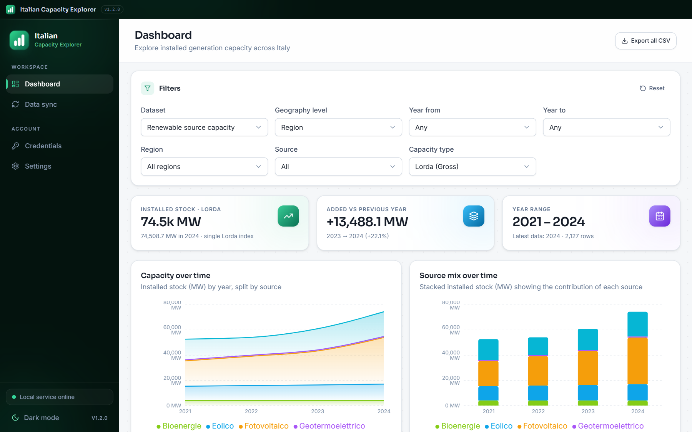
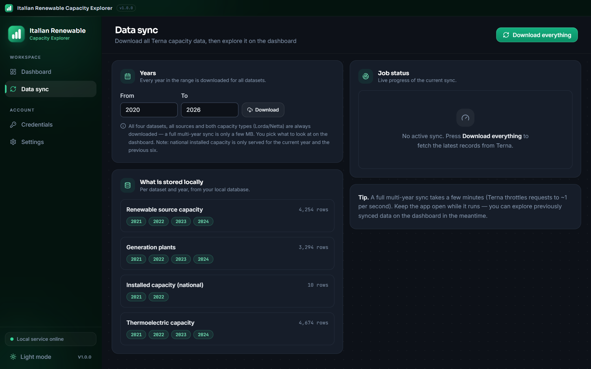
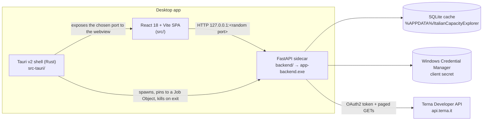

# Italian Capacity Explorer

A local-first Windows desktop application to explore **Italy's installed generation
capacity** published through the [Terna Developer API](https://developer.terna.it).

React + TypeScript UI, Tauri v2 shell (Rust) and a FastAPI backend packaged as a
sidecar: the webview, the data cache and the credentials all stay on the user's
machine — nothing is proxied through a third-party server.

> **Disclaimer** — this is an independent, community project. It is **not**
> affiliated with, endorsed by or supported by Terna S.p.A. Data is © Terna S.p.A.
> and is retrieved with each user's own free Terna Developer credentials.

---

## Table of contents

- [Features](#features)
- [Architecture](#architecture)
- [Repository layout](#repository-layout)
- [Requirements](#requirements)
- [Getting started](#getting-started)
- [Running the full desktop app](#running-the-full-desktop-app)
- [Building the Windows installer](#building-the-windows-installer)
- [Configuration](#configuration)
- [Backend HTTP API](#backend-http-api)
- [Data model and analytics semantics](#data-model-and-analytics-semantics)
- [Testing](#testing)
- [Privacy and security](#privacy-and-security)
- [Distributing the installer (and the SmartScreen warning)](#distributing-the-installer-and-the-smartscreen-warning)
- [Troubleshooting](#troubleshooting)
- [Known limitations](#known-limitations)
- [Contributing](#contributing)
- [License](#license)

---

## Features

- **Guided onboarding** for Terna Developer credentials (client id + secret).
- **One-click sync**: any year range, every dataset/source/capacity type.
  Rate-limit aware (1 request/second by default), resumable, per-step progress,
  and it never aborts the whole job because one step failed.
- **Dashboard**: KPI cards (latest-year stock, year-on-year additions, year range),
  five interactive charts, and a searchable, sortable, paginated records table.
- **Exports**: any chart as PNG / SVG / CSV, the filtered table as CSV.
- **Offline after sync**: SQLite cache, self-hosted fonts, light & dark themes.

### Screenshots

| Dashboard (dark) | Dashboard (light) | Data sync |
| --- | --- | --- |
|  |  |  |

## Architecture



| Piece | Technology | Responsibility |
| --- | --- | --- |
| Frontend | React 18, TypeScript, Vite, Tailwind, TanStack Query, Recharts | Dashboard, filters, charts, exports, onboarding |
| Shell | Rust, Tauri v2 | Frameless window, picks a free port, spawns/supervises/kills the sidecar, exposes the port via the `backend_port` command |
| Backend | Python 3.11+, FastAPI, httpx, SQLite (stdlib), keyring | Terna OAuth2 client, rate-limited sync jobs, normalisation, analytics, CSV export |
| Storage | SQLite (`terna_cache.sqlite`) | One row per dataset/year/geo/source/capacity-type combination, upserted by a stable `record_key` |

The shell picks a **free localhost port** on every launch, so two instances can run
side by side and no fixed port is ever exposed. The frontend resolves it at runtime
(`window.__TERNA_API_BASE__`), falling back to `VITE_API_BASE_URL` in the browser.

## Repository layout

```
├── src/                      React SPA (pages, components, hooks, api client)
├── src-tauri/                Tauri v2 shell
│   ├── src/lib.rs            port selection, sidecar supervision, Job Object
│   ├── tauri.conf.json       window, CSP, bundle (NSIS) configuration
│   └── bin/app-backend/      PyInstaller sidecar build output (git-ignored)
├── backend/                  FastAPI service (the sidecar source)
│   ├── src/terna_backend/    api, sync, storage, normalize, terna_client, settings
│   ├── tests/                pytest suite (mocked Terna client, no credentials)
│   ├── run_backend.py        sidecar entry point (port from argv[1]/TERNA_PORT)
│   └── app-backend.spec      PyInstaller recipe
├── scripts/release.ps1       typecheck → build → bundle (+ optional code signing)
├── docs/                     screenshots, code-signing guide, data validation
├── .github/workflows/        CI (typecheck, build, backend tests) and Release
└── .env.example              frontend dev overrides
```

## Requirements

| Tool | Version | Notes |
| --- | --- | --- |
| Node.js | ≥ 20 | frontend build |
| Rust | ≥ 1.77.2 | MSVC toolchain (`rustup default stable-msvc`) |
| Python | ≥ 3.11 | backend only (3.13 is what the shipped sidecar is built with) |
| WebView2 | any | preinstalled on Windows 10/11; the installer bootstraps it otherwise |
| OS | Windows 10/11 x64 | the shipped sidecar is Windows-only |

## Getting started

```powershell
git clone <your-fork-url>
cd italian-capacity-explorer

# 1. frontend dependencies
npm install

# 2. backend dependencies (virtualenv recommended)
python -m venv .venv
.\.venv\Scripts\Activate.ps1
pip install -e "backend[dev]"
```

Start the backend on the fixed dev port and the SPA in the browser:

```powershell
# terminal 1 — API on http://127.0.0.1:8765
python -B -m uvicorn backend.src.terna_backend.api:app --reload --port 8765

# terminal 2 — SPA on http://localhost:1420
npm run dev
```

The browser workflow is the fastest loop for UI work: the SPA falls back to
`VITE_API_BASE_URL` (default `http://127.0.0.1:8765`) when it is not running
inside Tauri. Credentials are still handled by the backend, so you can exercise
the whole sync flow there.

## Running the full desktop app

`tauri dev` spawns the **packaged sidecar**, so build it once first:

```powershell
cd backend
python -B -m PyInstaller app-backend.spec --noconfirm --distpath dist --workpath build
# copy the build output into the shell's resource folder
robocopy dist\app-backend ..\src-tauri\bin\app-backend /MIR
cd ..
npm run tauri:dev
```

Rebuild the sidecar (re-run the two commands above) after every backend change —
`tauri dev` does not rebuild Python.

## Building the Windows installer

```powershell
npm run release                       # typecheck + build + NSIS bundle
npm run release -- -Thumbprint <hex>  # same, and code-sign everything
```

Artifacts land in `src-tauri/target/release/bundle/nsis/`. The bundle ships:

- the Tauri executable and the NSIS installer (`…_x64-setup.exe`, per-user install),
- the sidecar (`bin/app-backend/`) as a resource,
- the WebView2 bootstrapper as a fallback.

Installers are **build outputs**: publish them as GitHub *Releases* artifacts,
never commit them to the repository.

## Configuration

Frontend (Vite, `.env`):

| Variable | Default | Purpose |
| --- | --- | --- |
| `VITE_API_BASE_URL` | `http://127.0.0.1:8765` | backend URL when running outside Tauri |

Backend (environment):

| Variable | Default | Purpose |
| --- | --- | --- |
| `TERNA_CLIENT_ID` / `TERNA_CLIENT_SECRET` | – | credentials for headless/dev runs (the GUI stores them itself) |
| `TERNA_MIN_REQUEST_INTERVAL` | `1.0` | minimum seconds between Terna API calls (raise it if you get `429`) |
| `TERNA_APP_DATA_DIR` | `%APPDATA%\ItalianCapacityExplorer` | database, settings and `backend.log` |
| `TERNA_PORT` | `8765` | override the port passed by the shell |

Data written at runtime:

| Path | Content |
| --- | --- |
| `%APPDATA%\ItalianCapacityExplorer\terna_cache.sqlite` | local cache (delete it to force a full re-sync) |
| `%APPDATA%\ItalianCapacityExplorer\settings.json` | non-secret settings (client id, database path) |
| `%APPDATA%\ItalianCapacityExplorer\backend.log` | sidecar stdout/stderr |
| `%LOCALAPPDATA%\com.italiancapacityexplorer.app\logs\terna-app.log` | shell logs |
| Windows Credential Manager → `italian-capacity-explorer` | the client **secret** |

Builds released before the rename used `TernaInstalledCapacity` and the
`terna-installed-capacity` credential entry; the backend migrates both on first
launch (the data folder is moved, the secret is copied to the new entry).

## Backend HTTP API

The sidecar serves a small JSON API on `127.0.0.1` (no authentication — see
[Privacy and security](#privacy-and-security)); `GET /docs` exposes the generated
OpenAPI UI while the backend runs.

| Method & path | Purpose |
| --- | --- |
| `GET /health` | readiness probe used by the shell |
| `GET /settings/credentials/status` | `{configured, client_id_suffix}` |
| `POST /settings/credentials` | store id + secret (secret → Credential Manager) |
| `DELETE /settings/credentials` | remove both |
| `POST /settings/credentials/test` | OAuth2 round-trip against Terna |
| `POST /sync/jobs` | start a sync job → `{job_id, status}` |
| `GET /sync/jobs/{id}` | `{status, total_steps, completed_steps, failed_steps, empty_steps, message, error}` |
| `GET /metadata/options` | canonical sources/types per dataset, stored options, year window |
| `GET /metadata/availability` | row counts per dataset/year actually cached |
| `GET /records` | paged rows (`limit` ≤ 100000, `offset`) |
| `GET /analytics/summary` | latest-year stock, previous year, YoY delta, row count |
| `GET /analytics/timeseries` | grouped sums, `group_by=year,source`, `latest_only=true` |
| `GET /export/csv` | every row matching the filters as CSV |

Filters accepted by `records`, `analytics/*` and `export/csv`: `dataset`,
`year_from`, `year_to`, `region`, `province`, `source`, `capacity_type`
(`Lorda`/`Netta`), `category`, `subcategory`, `type`.

## Data model and analytics semantics

One `capacity_records` row is a dataset × year × geography × source × capacity-type
combination:

| Column | Unit | Notes |
| --- | --- | --- |
| `dataset` | – | `renewable_source_capacity`, `generation_plants`, `installed_capacity`, `thermoelectric_capacity` |
| `year`, `region`, `province`, `source`, `category`, `subcategory`, `type`, `capacity_type` | – | dimension; `NULL` when the endpoint does not publish it |
| `efficient_power_mw` | MW | renewable, generation-plants and thermoelectric datasets |
| `installed_capacity_gw` | GW | national `installed_capacity` dataset only |
| `fetched_at` | ISO-8601 UTC | last successful fetch |

Analytics rules the UI relies on:

- **Stock, not sum.** Totals and `latest_only` aggregations refer to the latest
  year in the selection. Summing several years would count the same plant
  several times.
- **One capacity index at a time.** `Lorda` (gross) and `Netta` (net) are never
  added together; `summary` defaults to `Lorda` and reports
  `capacity_type_applied`.
- **Year-on-year additions** are the delta of that stock between the last two
  years in the selection — a proxy for new capacity, net of decommissioning.
- **Empty is not an error.** Terna answers unpublished years/values with an empty
  body, so the sync counts them as `empty_steps`.

Units caveat: the Terna `/installed-capacity` payload labels the field
`installed_capacity_GWh` but returns GW values (`"59.7902"` = 59.7902 GW). The
backend stores them as `installed_capacity_gw` and parses dot-decimal strings
correctly; do not trust the upstream field name.

[`docs/data-validation.md`](docs/data-validation.md) documents the validation of
these numbers against the raw API and against Terna's official yearbook: wind,
geothermal and thermoelectric totals match to the decimal, while the API's
hydro and older photovoltaic series use a narrower perimeter than the published
statistics. Quote the yearbook (or GSE) for official national figures; use this
app for trends, regional breakdowns and exports.

## Testing

```powershell
npm run typecheck     # strict TypeScript, no emit
npm run build         # production bundle (also validates the Vite build)

python -B -m pytest backend/tests -p no:cacheprovider   # 22 tests, mocked Terna API
```

The backend suite runs without credentials and without network access. There is
no frontend test runner yet (see [Known limitations](#known-limitations)); UI
changes are verified by running the app.

## Privacy and security

- Outbound traffic is limited to `api.terna.it` (OAuth2 token + data endpoints).
  No analytics, telemetry, update checks or third-party CDNs.
- The server binds `127.0.0.1` and serves both the API and the interface from the
  same origin; a strict `Content-Security-Policy` is sent on every response. No
  CORS headers are emitted, so a hostile page cannot read local responses.
- The client **secret** is encrypted with **Windows DPAPI** (user scope) into
  `secret.bin` inside the app data folder; on macOS it goes to the Keychain, on
  Linux to the `secret-tool` store. The client id stays in `settings.json`
  because it is not a secret.
- **The app never reads credentials belonging to other applications.** No
  script interpreter is spawned (no PowerShell, no shell), no OS credential
  vault is queried, nothing is written outside the app data folder and the log
  file. Automated scanners flag such patterns — correctly — as infostealer
  behaviour, so the code avoids them by design.
- The API has **no authentication**: any local process can read the cache and
  overwrite the stored credentials (it can never read the secret back — the API
  only ever returns `configured` plus a masked id). Treat the machine's other
  users/processes as trusted.
- The single-file executable produced by `bun build --compile` is unsigned, so
  antivirus heuristics and SmartScreen will scrutinise it; signing is the fix
  (see below). The npm channel (`bunx italian-capacity-explorer`) never builds or
  ships a binary.

## Code signing policy

Free code signing provided by [SignPath.io](https://about.signpath.io),
certificate by [SignPath Foundation](https://signpath.org).

- **Committers and reviewers**: the repository owner (single-maintainer project).
- **Approvers**: the repository owner — every release is approved manually before
  it is signed.

This program will not transfer any information to other networked systems unless
specifically requested by the user or the person installing or operating it.
Outbound connections go to `api.terna.it` (the Terna Developer API, with the
credentials the user enters) and to the local backend on `127.0.0.1`; there is
no telemetry, no update check and no third-party service. The app installs per
user and ships an uninstaller, and it does not modify system settings.

## Distributing the installer (and the SmartScreen warning)

Windows shows *“Windows protected your PC — unknown publisher”* for **unsigned**
executables. SmartScreen cannot be disabled by configuration; it is a trust
decision made by Windows. [`docs/signing.md`](docs/signing.md) compares the
options that actually work — free signing for open-source projects (SignPath
Foundation), a commercial OV/EV certificate, or Azure Artifact Signing — and
explains how to plug each one into `scripts/release.ps1` or into the `Release`
GitHub Actions workflow. The options are:

| Build | First-run experience |
| --- | --- |
| Unsigned | SmartScreen warning → *More info* → *Run anyway* |
| Signed with an OV certificate | Publisher name is shown; reputation grows with downloads |
| Signed with an EV certificate | Trusted immediately |

To sign, import a code-signing certificate and run:

```powershell
powershell -ExecutionPolicy Bypass -File scripts/release.ps1 -Thumbprint <cert-thumbprint>
# or: $env:TAURI_SIGNING_THUMBPRINT = "<hex>"; npm run release
```

Tauri then signs the app executable, the uninstaller and the NSIS installer
(SHA-256 + RFC-3161 timestamping). Both `npm run release` and the release
workflow stage the publishable files — with space-free names and a checksum
manifest — in `src-tauri/target/release/assets/`:

| File | Audience |
| --- | --- |
| `ItalianCapacityExplorer_<version>_x64-setup.exe` | everyone: double-click, per-user install, Start menu entry, uninstaller, WebView2 bootstrapped |
| `ItalianCapacityExplorer_<version>_x64-portable.zip` | no-install: extract to a folder and run `app.exe` |
| `SHA256SUMS.txt` | download verification (`Get-FileHash <file> -Algorithm SHA256`) |

Never commit these: attach them to a GitHub Release, whose notes follow
[`.github/release-notes.md`](.github/release-notes.md).

### Portable build (no installer)

Unzip the archive anywhere and run `app.exe` — the backend sidecar sits in
`bin\app-backend\` next to it, so nothing has to be installed.

- Running `app.exe` **from inside the zipped folder** (Windows' compressed-folder
  view) starts the app without its backend, because the sibling folder is not
  there: extract everything first.
- The unpacked folder is ~61 MB (837 files) and the app picks a free local port
  at every launch, exactly like the installed build.
- The **first launch from a freshly unzipped folder can take ~1 minute**: the
  shell waits while Windows Defender scans the sidecar's files. Later launches
  are ready in a few seconds, and the sidebar shows the backend state meanwhile.
- WebView2 must already be on the machine — Windows 10/11 ships it, but the
  installer can bootstrap it and the portable archive cannot.
- User data still lives in `%APPDATA%\ItalianCapacityExplorer`: this is
  “no install”, not “no traces”. There is no Start Menu entry and no uninstaller,
  so deleting the folder removes the application.
- If the build was signed, the `app.exe` inside the archive is signed too.

## Troubleshooting

| Symptom | Cause / fix |
| --- | --- |
| “The local data service is not responding” | the sidecar is still starting (up to a few seconds) or crashed — check `%APPDATA%\ItalianCapacityExplorer\backend.log` and `%LOCALAPPDATA%\com.italiancapacityexplorer.app\logs\terna-app.log` |
| Sync reports many skipped steps | Terna rate limiting (`429`/`403 Developer Over Qps`); they are retried, then reported as `failed_steps` — re-run the sync, already stored steps are upserted |
| Sync reports many empty steps | years or combinations the API does not publish (for example `/installed-capacity` currently returns data only for a subset of years) |
| Charts show nothing for a dataset | that dataset was never downloaded: run a sync covering its years |
| `tauri dev` fails to start the backend | the sidecar was not built — see [Running the full desktop app](#running-the-full-desktop-app) |
| Installer complains about a running instance | close the app before re-installing; silent (`/S`) installs skip locked files |

## Known limitations

- **Windows only**: the Tauri shell is cross-platform, but only a Windows sidecar
  is built here (add a `pyinstaller` target per OS to support more).
- **No auto-updater** (Tauri updater is not wired up); users re-run the installer.
- **No frontend test runner** yet — `npm run typecheck` plus a manual smoke test
  is the current gate.
- **Upstream data quirks** are surfaced as-is:
  `/installed-capacity` publishes GW values in a field named `installed_capacity_GWh`
  and currently returns rows for a subset of years only;
  region names differ in casing between endpoints (`Valle D'Aosta` vs `Valle d'Aosta`),
  which shows up as two entries in the region filter.
- **Rate limiting** is the practical ceiling of a full multi-year sync: requests
  are paced at ~1/second, so a full refresh takes a few minutes. Terna also
  enforces a broader request quota beyond QPS (HTTP 403, `Developer Over Rate`):
  a four-year "download everything" run issues ~108 requests and can trip it.
  The sync never aborts — it retries with backoff, records the affected steps as
  `failed_steps` and can be re-run later to fill the gaps.
- **Zero values are stored as returned**: for a few province/year cells the API
  reports `0` (or omits the value) for one capacity index, typically hydro
  *Lorda* — harmless for totals, visible if you filter that province.

## Contributing

Issues and pull requests are welcome.

1. Create a branch from `main`.
2. Keep the TypeScript strict (`npm run typecheck`) and the backend suite green
   (`python -B -m pytest backend/tests`).
3. Match the existing style: small components, hooks for data access, no remote
   assets, no hardcoded domain values in the frontend (use `/metadata/options`).
4. Do not commit build outputs (`dist/`, `src-tauri/target/`, `src-tauri/bin/`,
   `backend/build/`, `backend/dist/`, installers) — they are git-ignored on purpose.
5. Never commit credentials or a shared Terna client secret: every user brings
   their own keys.

## License

[MIT](LICENSE) © 2026 Tommaso D'Acunzio.

The Terna Developer API, the data it publishes and the "Terna" trademark belong to
Terna S.p.A.; this project only consumes the public API with the user's own
credentials and is not affiliated with or endorsed by Terna S.p.A.
