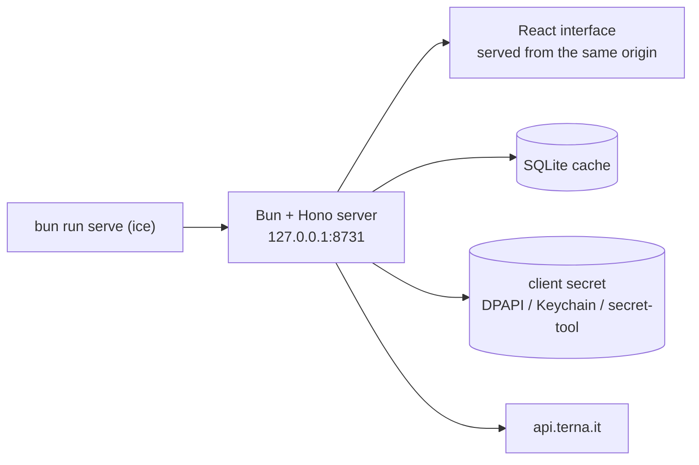

**Explore Italy's renewable installed capacity — solar, wind, hydro, bioenergy and
geothermal — region by region, with charts, tables and CSV exports.**
Thermoelectric capacity and the national totals are included for comparison. The
data comes from the [Terna Developer API](https://developer.terna.it) and is
cached in a local SQLite database: after the first sync the app works offline,
and nothing leaves your machine.

It runs as a small local server that also serves its own interface: open it in a
browser, or install it as an app with its own window and Start-menu entry.

> Independent project, **not** affiliated with or endorsed by Terna S.p.A. The
> data is © Terna S.p.A. and is fetched with each user's own free credentials.


## Features

- **Guided setup** for Terna Developer credentials — the secret is encrypted with
  Windows DPAPI (Keychain on macOS, `secret-tool` on Linux) and never leaves the
  machine.
- **One-click sync** of any year range: every dataset, source and capacity type,
  paced to respect the API limits, resumable, with per-step progress.
- **Dashboard** with KPI cards (latest-year stock, year-on-year additions), four
  charts and a searchable, sortable, paginated table.
- **Exports**: any chart as PNG or SVG, the filtered data as CSV.
- **Offline after sync**, light and dark themes, no telemetry.

## Get started

The package is not on npm yet, so the app runs from a checkout — with
[Bun](https://bun.sh) installed:

```bash
git clone https://github.com/tomdacu/italian-renewable-capacity-explorer
cd italian-renewable-capacity-explorer
bun install
bun run prepack        # build the interface into dist/ and static/ (needed before serving)
bun run serve          # local server + browser window on 127.0.0.1:8731
```

The app serves itself on `http://127.0.0.1:8731` and opens a browser window. Use
your browser's *Install app* to get a standalone window with its own icon — the
installed app is bound to the **origin** it was installed from, port included. If
`8731` is busy the server starts on a free port instead and says so in
`backend.log`: the app then points at the old origin and has to be reinstalled
from the new one, which is the URL **Settings → Install** shows.

Once the package is published to npm, `bunx italian-renewable-capacity-explorer`
will be the one-line equivalent of that clone.

Then, inside the app:

1. create a free application on [developer.terna.it](https://developer.terna.it)
   and paste Client ID and secret in **Credentials**;
2. open **Data sync**, press *Download everything* — the range defaults to
   2000 → the latest year already in your cache, one request per dataset and
   year, paced at ~1/second to stay inside the API limits. Any year the API
   accepts can be typed in by hand, including one Terna has not published yet:
   those steps come back empty and are reported as such, they are not failures;
3. explore the **Dashboard**, where every chart can be copied or exported.


### Development

`bun run dev` starts the Vite dev server with hot reload (run `bun run serve` too) and `bun test`
runs the suite. Everything else — the build the server needs before it can serve the interface, the
dev proxy and `ICE_DEV_ORIGIN`, the standalone executable, flags and troubleshooting — is in
[docs/configuration.md](docs/configuration.md#development).

## How it works



One process, one origin: the same server exposes the data API and the interface,
so the browser only ever talks to `127.0.0.1`. Server and interface share their
types (`shared/types.ts`), and the Terna client is tested against an injected
`fetch` — the suite runs without network access or credentials.

## Data

Four datasets: renewable capacity by source, generation plants, national
installed capacity and thermoelectric capacity — each by year, geography,
capacity type (`Lorda`/`Netta`) and, where published, category.

Totals use the **stock of the latest year** with a **single capacity index**:
summing years or both indexes would count the same megawatts several times.
The app also states which dataset matches Terna's published yearbook year by
year, because the API does not revise older years the way the yearbook does.

- [Data model and semantics](docs/data-model.md)
- [Validation against the yearbook, the press and independent analyses](docs/data-validation.md)

## Documentation

| Document | Content |
| --- | --- |
| [docs/data-model.md](docs/data-model.md) | tables, units, analytics rules, dataset alignment |
| [docs/api.md](docs/api.md) | the local HTTP API, filters and response shapes |
| [docs/configuration.md](docs/configuration.md) | environment variables, CLI flags, file locations, troubleshooting |
| [docs/data-validation.md](docs/data-validation.md) | how the numbers were checked, and where they differ from other sources |

## Privacy and security

- Outbound traffic goes only to `api.terna.it`; no telemetry, no analytics, no
  third-party services.
- The server binds `127.0.0.1` and sends a strict `Content-Security-Policy`. It
  sends no `Access-Control-Allow-Origin`, so a page on another origin cannot read
  the responses; the one header it does expose, `x-total-count` on `/records`, is
  readable only by a reader that could already call the API.
- The API has no authentication: any local process can read the cache and
  overwrite the stored credentials, but can never read the secret back.

Details in [docs/configuration.md](docs/configuration.md).

## Status

Early, single-author project: 121 tests across 9 files (`bun test`, plus a build
in CI) cover the server modules — HTTP routes, storage, settings, sync planning,
the Terna client against an injected `fetch` — and the interface's pure modules
that run without a browser (`src/lib/csv.ts`, `chart-data.ts`, `chart-csv.ts`)
together with the API client (`src/api/client.ts`). Coverage is not uniform:
`src/lib/utils.ts` has no test of its own — it sits on a tested path only through
`src/lib/chart-data.ts`, which imports `formatMw` and `formatGw`, and its
formatters are never asserted directly — while `src/lib/version.ts` and
`src/lib/constants.ts` are imported only by components. What is missing is a
DOM/component runner: there is no vitest/jsdom setup, so the React components
themselves are verified by hand. Known limits and upstream data quirks are listed
in [docs/data-validation.md](docs/data-validation.md); the practical ones are the
Terna request limits (one call per second, plus a broader quota the client waits
out) and the two hydro perimeters.

## Contributing

Issues and pull requests are welcome. Install [Bun](https://bun.sh), run
`bun install`, and keep `bun test` and `bun run typecheck` green. Do not commit
build outputs (`dist/`, `static/`, `dist-exe/`); never commit credentials.

## License

[MIT](LICENSE) © 2026 Tommaso D'Acunzio.
