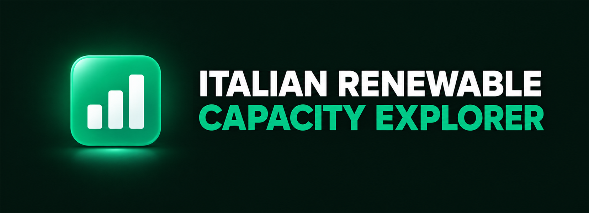
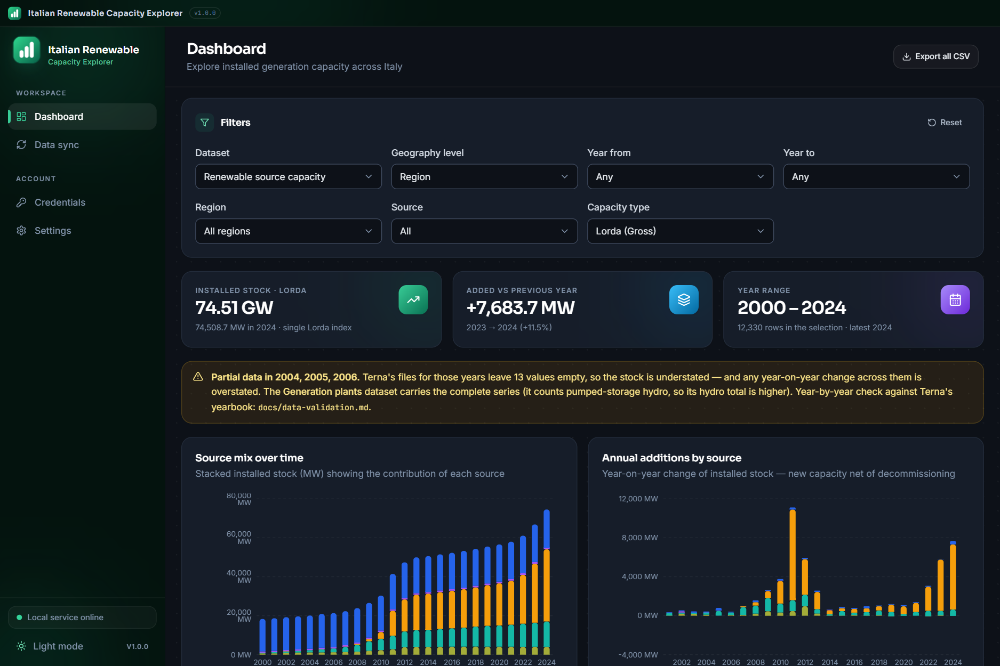
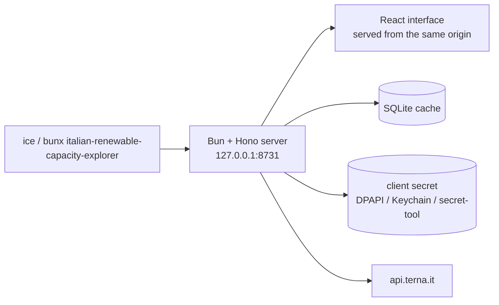

# Italian Renewable Capacity Explorer



**Explore Italy's renewable installed capacity — solar, wind, hydro, bioenergy and
geothermal — region by region, with charts, tables and CSV exports.**
Thermoelectric capacity and the national totals are included for comparison. The
data comes from the [Terna Developer API](https://developer.terna.it) and is
cached in a local SQLite database: after the first sync the app works offline,
and nothing leaves your machine.

It runs as a small local server that also serves its own interface: open it in a
browser, or install it as an app with its own window and Start-menu entry.

> Independent project, **not** affiliated with or endorsed by Terna S.p.A. The
> data is © Terna S.p.A. and is fetched with each user's own free credentials.



## Features

- **Guided setup** for Terna Developer credentials — the secret is encrypted with
  Windows DPAPI (Keychain on macOS, `secret-tool` on Linux) and never leaves the
  machine.
- **One-click sync** of any year range: every dataset, source and capacity type,
  paced to respect the API limits, resumable, with per-step progress.
- **Dashboard** with KPI cards (latest-year stock, year-on-year additions), five
  charts and a searchable, sortable, paginated table.
- **Exports**: any chart as PNG or SVG, the filtered data as CSV.
- **Offline after sync**, light and dark themes, no telemetry.

## Get started

With [Bun](https://bun.sh) installed — nothing to download, always current:

```bash
bunx italian-renewable-capacity-explorer
```

The app serves itself on `http://127.0.0.1:8731` and opens a browser window. Use
your browser's *Install app* to get a standalone window with its own icon.

Then, inside the app:

1. create a free application on [developer.terna.it](https://developer.terna.it)
   and paste Client ID and secret in **Credentials**;
2. open **Data sync**, press *Download everything* — the range defaults to every
   year Terna publishes (2000 → today), one request per dataset and year, paced
   at ~1/second to stay inside the API limits;
3. explore the **Dashboard**, where every chart can be copied or exported.

### From source

```bash
git clone https://github.com/tomdacu/italian-renewable-capacity-explorer
cd italian-renewable-capacity-explorer
bun install
bun run prepack        # build the interface into static/ (needed before serving)
bun run serve          # local server + browser window on 127.0.0.1:8731
bun run dev            # Vite dev server with hot reload; run `bun run serve` too
bun test               # 53 tests
```

The interface is built, not committed: without `bun run prepack` (or `bun run
build`) the server answers 500 "Interfaccia non trovata" — it has the API but
nothing to show. The dev server proxies the API to `127.0.0.1:8799` by default,
so start the local server with `bun run serve --port 8799` if you use `bun run
dev`.

To get a single executable: `bun run compile` writes `dist-exe/ice.exe` **with
its `static/` folder next to it** — the two must travel together.

## How it works



One process, one origin: the same server exposes the data API and the interface,
so the browser only ever talks to `127.0.0.1`. Server and interface share their
types (`shared/types.ts`), and the Terna client is tested against an injected
`fetch` — the suite runs without network access or credentials.

## Data

Four datasets: renewable capacity by source, generation plants, national
installed capacity and thermoelectric capacity — each by year, geography,
capacity type (`Lorda`/`Netta`) and, where published, category.

Totals use the **stock of the latest year** with a **single capacity index**:
summing years or both indexes would count the same megawatts several times.
The app also states which dataset matches Terna's published yearbook year by
year, because the API does not revise older years the way the yearbook does.

- [Data model and semantics](docs/data-model.md)
- [Validation against the yearbook, the press and independent analyses](docs/data-validation.md)

## Documentation

| Document | Content |
| --- | --- |
| [docs/data-model.md](docs/data-model.md) | tables, units, analytics rules, dataset alignment |
| [docs/api.md](docs/api.md) | the local HTTP API, filters and response shapes |
| [docs/configuration.md](docs/configuration.md) | environment variables, CLI flags, file locations, troubleshooting |
| [docs/data-validation.md](docs/data-validation.md) | how the numbers were checked, and where they differ from other sources |

## Privacy and security

- Outbound traffic goes only to `api.terna.it`; no telemetry, no analytics, no
  third-party services.
- The server binds `127.0.0.1` and sends a strict `Content-Security-Policy`; no
  CORS headers, so other pages cannot read local responses.
- The API has no authentication: any local process can read the cache and
  overwrite the stored credentials, but can never read the secret back.

Details in [docs/configuration.md](docs/configuration.md).

## Status

Early, single-author project: the server and the interface are covered by tests
(`bun test`, plus a build in CI), while the interface itself has no test runner
yet. Known limits and upstream data quirks are listed in
[docs/data-validation.md](docs/data-validation.md); the practical ones are the
Terna request limits (one call per second, plus a broader quota the client waits
out) and the two hydro perimeters.

## Contributing

Issues and pull requests are welcome. Install [Bun](https://bun.sh), run
`bun install`, and keep `bun test` and `bun run typecheck` green. Do not commit
build outputs (`dist/`, `static/`, `dist-exe/`); never commit credentials.

## License

[MIT](LICENSE) © 2026 Tommaso D'Acunzio.
